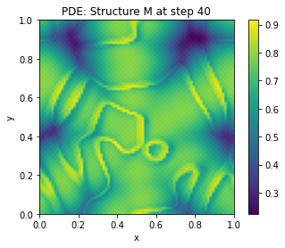
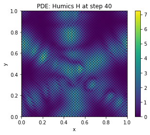
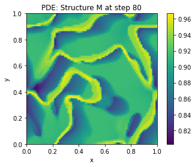
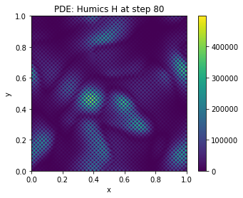
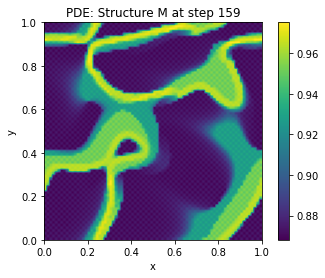
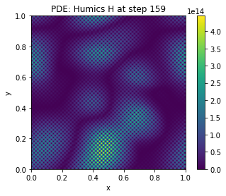
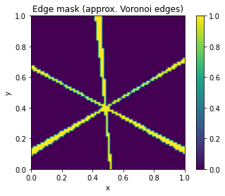

# Yarncrawler in Action

**Yarncrawler in Action** is a research project exploring the **Yarncrawler Framework** — a model of self-repairing computation — and its connections to  
- **RSVP field theory** (scalar Φ, vector 𝒗, entropy S),  
- **stigmergic processes** in culture and ecology (e.g., terra preta), and  
- **AI architectures** like mixture-of-experts with retrieval-augmented generation (RAG).  

The project sits at the intersection of mathematics, biology, anthropology, and computation, aiming to show how systems endure by **repairing themselves through recursive reweaving**.

---

## Contents

- `manuscript/` — LaTeX draft of the essay *Yarncrawler in Action*  
- `simulations/` — simple Python models of stigmergic berms and RSVP fields  
- `figures/` — supporting diagrams and plots  

---

## Highlights

- Introduces the **Yarncrawler Functor Master Equation (YFME)**.  
- Sheaf-theoretic view of semantic parsing as local patching and global repair.  
- Cultural analogy: terra preta soils as long-lived stigmergic Yarncrawlers.  
- Future directions: synthetic terra preta, sanitation systems, and “terra preta rain.”  

## Stigmergic Berms - Simulation

  
  
  

  
  
  
  

